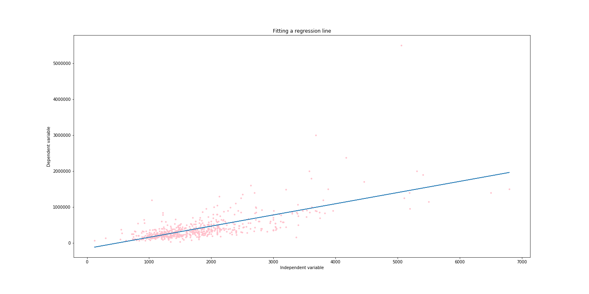
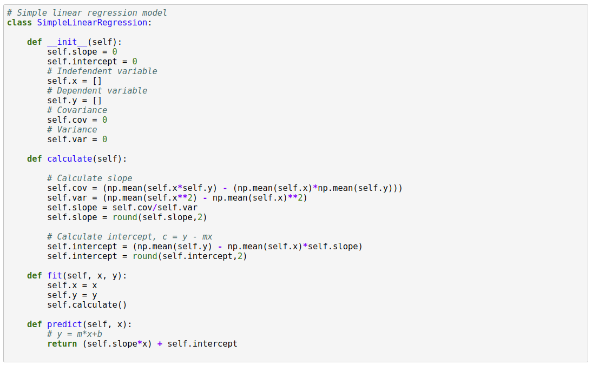
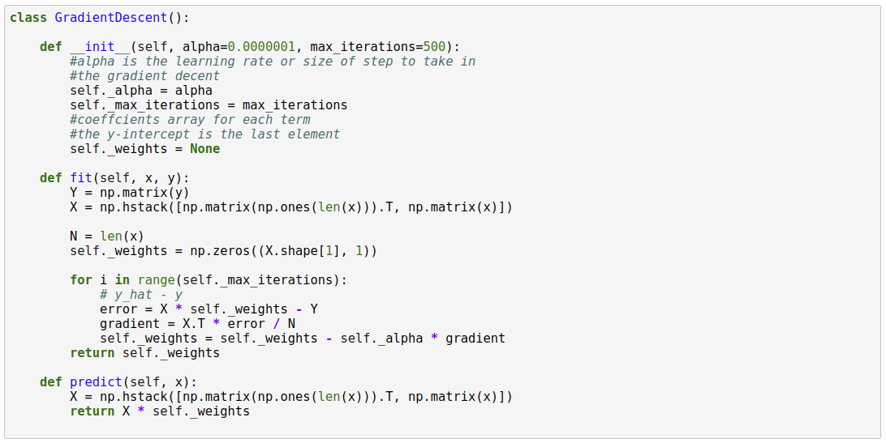

# Understanding Linear Regression

Maximum learning is achieved by practical experimentation. Theory helps get a grasp, but nothing is more satisfying as coding the theory concept in your favourite language and see it work, that magician feeling. In this blog I will go through a simple concept of Regression and to be specific discuss about Simple linear regression. 

There are several packages in every possible programming languages and productive applications which abstract the concept and get straight to the result. These packages and plugins do such a good job sometimes it is hard to get a full grasp of the algorithms that does the magic under the hood.

This blog is an attempt to uncover the working of the linear regression. We will consider the simplest dumbest data and produce a simple linear regression model and in the process decode its inner working.

The dataset we will be using http://wiki.csc.calpoly.edu/datasets/attachment/wiki/Houses/RealEstate.csv?format=raw from the wiki.csc.calpoly.edu. The data is quite old but for illustration purposes, it should be fine.

Using this dataset we will now implement the simple linear regression algorithm from scratch in Python.

## The Plan

Let's begin by find a new relation, I mean a linear relationship between our beloved X and Y. We want to find a straight line relationship between the X (independent variable) and Y (dependent variable). This is called simple linear regression where we are trying to find what linear combination of X (input) will produce Y (output) 

We will look at 2 approachs to finding a regression line.

--  using equations
--  using gradient descent

## Lieutenant Commander Data


No, not that Data. Here is our data plotted as scatter plot.


Our aim is to find a straight line that connects all the data point.

 Straight line you say?

Well intuitively you can see that it is   to find a straight line that goes through all the points. We will find a approximate line that is representative of all the points hugging the line.



## Statistical Equations

Let's begin with the equation of a straight line.

Y' = m*X + c   

where m is the coefficient of independent variable (slope) and c is the Y-intercept.

**Slope**: a number measuring the steepness of a line relative to the x-axis.
The slope of a line is usually calculated by dividing the amount of change in Y by the amount of change in X. The slope of the regression line can be calculated by dividing the covariance of X and Y by the variance of X.

The mathematical formula to calculate slope (m) is: covariance / variance  

**Covariance**: a measure of how much two variables change with respect to one another.

The mathematical formula to calculate covariance is: mean(x*y) - mean(x) * mean(y) 

**Variance**: a statistic used to describe the spread of data about the mean.

The mathematical formula to calculate variance is:  mean( x^2) - mean (x)^2  

**Y-intercept**: the point at which a line crosses the Y-axis.

The formula to calculate intercept (c) is: mean(y) – mean(x) * m  

Check the video link below for more information on the equation and derivation.

https://www.khanacademy.org/math/statistics-probability/describing-relationships-quantitative-data/more-on-regression/v/covariance-and-the-regression-line

Now, let’s write a function to calculate intercept and slope (coefficient):


We will take these learnings and now build a model that can learn from the training data and predict the outcome for given test data.



This is a very simple model, that demonstrate the working of simple linear regression.
The 2 main functions are the fit and predict.

Usage example:


Plotting the test predication vs the actaul test points.


Pictorial comparision of Y values in test and the Predicted values


### Evaulation

Now that we have a model, we need a way evaualte or read the model. 

### Root Mean Squared Error(RMSE)

RMSE is the standard deviation of the residuals (prediction errors). Residuals are a measure of how far from the regression line data points are, and RMSE is a measure of how spread out these residuals are.

Let’s define a function for RMSE:


### R-squared

R-squared is a statistical measure of how close the data are to the fitted regression line. It is also known as the coefficient of determination

R-squared is always between 0 and 100%:

0% indicates that the model explains none of the variability of the response data around its mean.
100% indicates that the model explains all the variability of the response data around its mean.


### sklearn

Let's see how our custom built model compares against the sklearn regression model output.


As you can see from the graph below, the regression line predicatd using our custom model overlaps with that of the library model. You can downlaod the ipython notebook and experiement with different datasets and see the results for yourself.

https://github.com/santhoshpkumar/understanding-linear-regression


## Gradient Descent

While the equation mention and the inverse matrix equation menthod can be used to calcualte the co-efficient they tend to become inefficient as the number of independent variables increases. As the number of features used in regression increases, the matrix operations required by the closed-form solution become computationaly expensive, if not impossible. The computational complexity for the closed-from solution is of the order
 
$$ O(n^3) $$

A most effecitve way to calculate the regression line would be using a menthod called gradient descent. I will not be covering details of the gradient descent but will hightlight the logic and the algorithm used to obtain a regression line.


To begin with imagine, we started with a random line, we  will calcuate a error metrics which will tell us how good or bad the line fit is. We then make gradual adjustments to the line co-efficient iteratively until we arrive at a more acceptable solution.

The cost function we will use it the residual sum of squares (RSS) 

Along with the cost funciton we will be using a **hyper parameter** to arrive at the solution. This hyper parameter is called the learning rate (alpha)

#### The algorithm

```
initialize coefficients

while gradient_magnitude >= tolerance:
    for each feature:
        updated_feature_coefficient = feature_coefficient - alpha*feature_derivative
return coefficients
```

Imagine the sample data from before. Lets pick a random line. 


Our cost function is defined as 
$$ RSS = (np.dot(fs, ws) - ys)^2 $$

Our gradient is derivate of cost function. 

so differentiation of cost function = (np.dot(fs, ws) - ys)^2 with respect to ws will give

$$ dw=2 *(np.dot(fs,ws) - ys)fs $$

for M examples, we have

$$ dw = 2 (np.dot(fs,ws) - ys)fs/(2M) $$

$$ dw = 2(diffs)fs/(2M) $$

$$ dw = diffs * fs/M $$

$$ np.dot(fs_transposed, diffs)/num_examples $$

We will iterate as indicated in the algorithm and arrive at the final weights (co-efficients) which can be used to predict for a new unseen data


### Model



### Usage


Final fit using the custom built model


#### Note

The abob method of using all the data set during each iteration is called batch gradient descent. There is alternative faster appraoch where only random part of the data set is used in each iteration and it is called stostatic gradient descent.

## Conclusion

We evaulated equations and gradient descent to find the best fit regression line.

The concpet can be furthur extended to multiple indepedent variable. To begin with the intuition, if we have 2 independent variables then a data point can be represented using the 3-axis  x, y and z 


As you might have guessed, the result or the predication is no longer on a straght line, rather a 2-dimensional plane.

This can be genralized saying that given a **n-dimension hyper space** the result lies on a **(n-1)-dimesnion hyper plane**
 
