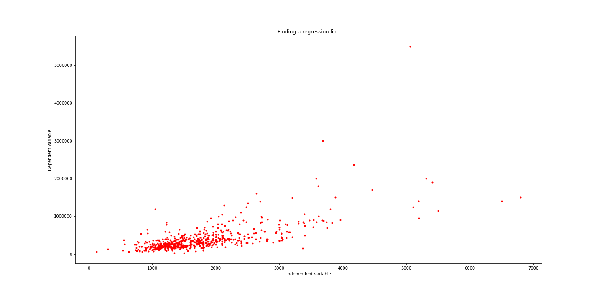
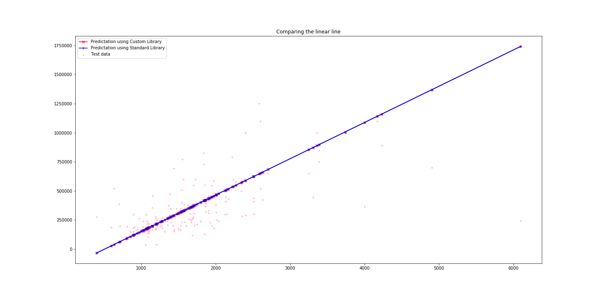

# Understanding Linear Regression

Maximum learning is achieved by practical experimentation. Theory helps get a grasp, but nothing is more satisfying as coding the theory concept in your favourite language and see it work, that magician feeling. In this blog I will go through a simple concept of Regression and to be specific discuss about Simple linear regression. 

There are several packages in every possible programming languages and productive applications which abstract the concept and get straight to the result. These packages and plugins do such a good job sometimes it is hard to get a full grasp of the algorithms that does the magic under the hood.

This blog is an attempt to uncover the working of the linear regression. We will consider the simplest dumbest data and produce a simple linear regression model and in the process decode its inner working.

We will consider the kaggle data set found here. 
https://www.kaggle.com/andonians/random-linear-regression

Using this dataset we will now implement the simple linear regression algorithm from scratch in Python.

## The Plan

Lets find a new relation, I mean a linear relationship between our beloved X and Y. We want to find a straight line relationship between the X (independent variable) and Y (dependent variable). This is called simple linear regression where we are trying to find what linear combination of X (input) will produce Y (output) 

## Lieutenant Commander Data

No not that Data. Here is our data from kaggle.

Our aim is to find a straight line that connects all the data point.

 Straight line you say?

Well intuitively you can see that it is   to find a straight line that goes through all the points. We will find a approximate line that is representative of all the points hugging the line.

Let's begin with the equation of a straight line.

Y' = m*X + c   

where m is the coefficient of independent variable (slope) and c is the Y-intercept.

**Slope**: a number measuring the steepness of a line relative to the x-axis.
The slope of a line is usually calculated by dividing the amount of change in Y by the amount of change in X. The slope of the regression line can be calculated by dividing the covariance of X and Y by the variance of X.

The mathematical formula to calculate slope (m) is: covariance / variance  

**Covariance**: a measure of how much two variables change with respect to one another.

The mathematical formula to calculate covariance is: mean(x*y) - mean(x) * mean(y) 

**Variance**: a statistic used to describe the spread of data about the mean.

The mathematical formula to calculate variance is:  mean( x^2) - mean (x)^2  

**Y-intercept**: the point at which a line crosses the Y-axis.

The formula to calculate intercept (c) is: mean(y) – mean(x) * m  

Check the video link below for more information on the equation and derivation.

https://www.khanacademy.org/math/statistics-probability/describing-relationships-quantitative-data/more-on-regression/v/covariance-and-the-regression-line

Now, let’s write a function to calculate intercept and slope (coefficient):

We will take these learnings and now build a model that can learn from the training data and predict the outcome for given test data.

This is a very simple model, that demonstrate the working of simple linear regression.
The 2 main functions are the fit and predict.

Usage example:

Plotting the test predication vs the actaul test points.

Pictorial comparision of Y values in test and the Predicted values

## Evaulation

Now that we have a model, we need a way evaualte or read the model. 

### Root Mean Squared Error(RMSE)

RMSE is the standard deviation of the residuals (prediction errors). Residuals are a measure of how far from the regression line data points are, and RMSE is a measure of how spread out these residuals are.

Let’s define a function for RMSE:

### R-squared

R-squared is a statistical measure of how close the data are to the fitted regression line. It is also known as the coefficient of determination

R-squared is always between 0 and 100%:

0% indicates that the model explains none of the variability of the response data around its mean.
100% indicates that the model explains all the variability of the response data around its mean.

Let's see how our custom built model fairs against the sklearn regression model output.

